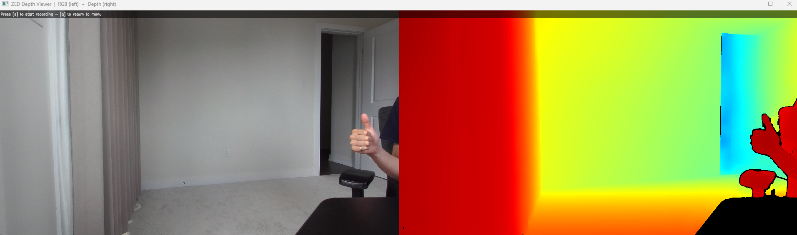
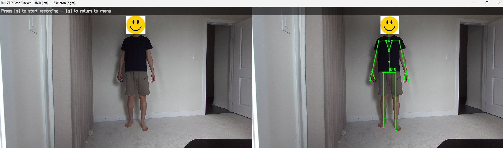
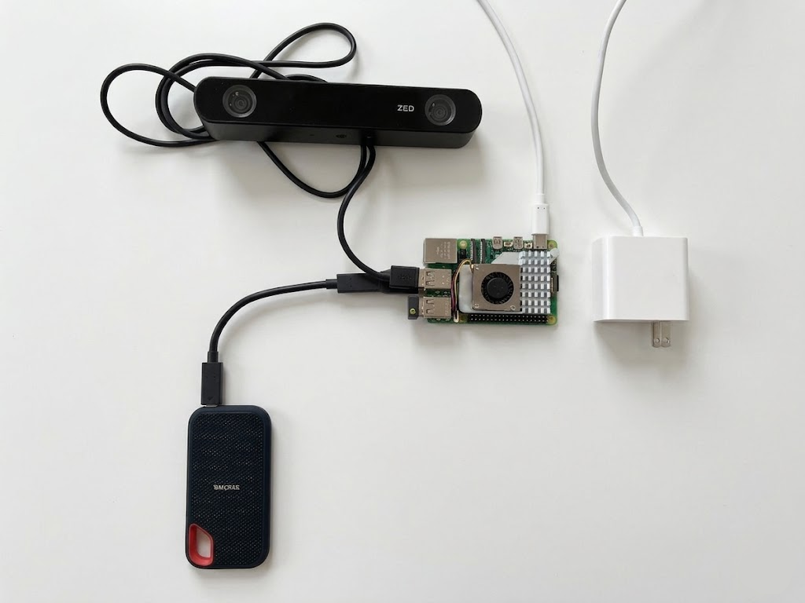
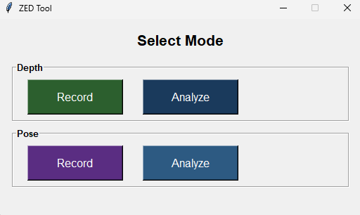

# WiSeR ZED2 Tool

This repo contains some tools we built for using the ZED2 stereo camera from Stereolabs (for depth sensing & pose tracking). 
The two major components within the repo include:
- **Part 1: A software that runs on Windows**: 
  1. we use the software to do depth sensing and pose tracking.
  2. venv is managed by uv. see pyproject.toml for more details.
  3. requires the ZED SDK and CUDA (+TensorRT to speed up inference).
  4. comes with a video.py script in software/tools that captures strero videoes in SVO format, which can be opened by the SDK.

See snapshots below to get a feeling of the software.




- **Part 2: Some tools that run on Raspberry Pi**: 
  1. we use the Pi mainly for data collection.
  2. does not require the SDK. treats the camera like a USB web cam.
  3. scripts are inside software/tools/raspberry_pi only.
  4. comes with two scripts: record.py (for recording a video) and process.py (for processing the video recorded into left / right rectified frames)

Here is our setup with the Pi.



## 1. Requirements

### 1.1 Windows Desktop
- Stereolabs ZED SDK 5.3.0 with CUDA 13.2 / TensorRT 10
- Python 3.10
- uv package manager

### 1.2 Raspberry Pi
- We used a Raspberry Pi 4
- USB 3.0 ports for the camera
- OpenCV 4.12.0
- not managed with uv and not run with uv

---

## 2. Windows Desktop Pipeline 

Setup with:

```
uv sync
```

To run the software:

```
cd software
uv run software.py
```

A mode selection window opens with four options:



### 2.1 Depth Record

Settings dialog (resolution, depth range) -> live RGB + depth overlay view.

| Key | Action |
|-----|--------|
| `s` | Start / stop recording |
| `q` | Return to menu |
| `[x]` | Close window and exit |

Saves to `software/recordings/depth_<timestamp>/`:
- `video.mp4` -- left rectified frames
- `depth.npz` -- per-frame depth data and timestamps

### 2.2 Depth Analyze

Folder picker -> matplotlib viewer. Click a pixel or drag a region to plot depth (m) over
time. Slider scrubs frames; `[>]` plays. `q` or `[x]` to exit.

### 2.3 Pose Record

Settings dialog (resolution, skeleton format BODY_18 / 34 / 38) -> live side-by-side view
(RGB left, skeleton overlay right).

| Key | Action |
|-----|--------|
| `s` | Start / stop recording |
| `q` | Return to menu |
| `[x]` | Close window and exit |

Saves to `software/recordings/pose_<timestamp>/`:
- `video.mp4` -- left rectified frames
- `pose.npz` -- 3D/2D keypoints, tracking IDs, and confidence per frame

### 2.4 Pose Analyze

Folder picker -> matplotlib viewer. Select a keypoint from the radio button list to plot
its X (red), Y (green), Z (blue) position in meters over time. The coordinate gizmo in the
video panel shows orientation: X = right, Y = up, Z = into screen. Slider scrubs frames;
`[>]` plays. `q` or `[x]` to exit.

---

## 3. Stereo SVO recorder

Records full stereo video in the ZED SDK's native SVO format.

```
cd software
uv run tools/video.py
```

Settings dialog: choose resolution and compression (H264 lossy default / H265 / Lossless).

| Key | Action |
|-----|--------|
| `s` | Start / stop recording |
| `q` | Return to menu |
| `[x]` | Close window and exit |

Saves to `software/tools/recordings/stereo_<timestamp>.svo2`.

---

## 4. Raspberry Pi Pipeline

SDK-free two-step workflow. More for data collection.

### 4.1 Prerequisites

Copy the ZED calibration file from a machine with the ZED SDK installed:

```
C:\ProgramData\Stereolabs\settings\SN<serial>.conf
```

Place it in `software/tools/raspberry_pi/calibration/`. The rectification calculation relies on this.
The SDK places the .conf file there so the SDK needs to run at least once on desktop.

### 4.2 Recording videoes on Pi

```
python record.py [HD2K|HD1080|HD720|VGA] [mkv]
```

Defaults to HD2K MP4 (lossy). Pass `mkv` for lossless capture (larger files, no quality
loss). Press Ctrl+C to stop; the recording is finalized and stats are printed.

Saves to `software/tools/raspberry_pi/recordings/raw_stereo_<timestamp>.mp4` (or `.mkv`).

Recorded frame rates (capped for Pi 4 disk throughput):

| Resolution | Composite size | Recorded fps |
|------------|----------------|-------------|
| HD2K | 4416 x 1242 | 7.5 |
| FHD | 3840 x 1080 | 10 |
| HD | 2560 x 720 | 15 |
| VGA | 1344 x 376 | 30 |

The ZED can do 15 FPS at HD2K, 30 FPS at other resolutions, but the PI cannot keep up with writing the videoes. 
Therefore, here we hardcoded some somewhat conservative limits to the FPS for the Raspberry PI. We have tested these on our PI and confirmed the PI worked OK. 

### 4.3 Rectify on Pi or elsewhere

```
python process.py <video_file_path> [HD2K|HD1080|HD720|VGA]
```

Need to pass the right resolution (from the video) to the argument, but can process both mp4 and mkv files.
Defaults to HD2K if resolution is not specified. 
We separated the rectification from record.py to free up the PI for data collection.

```
<filename>_extracted_<suffix>/
  left_rectified/
    frame_000000.png
    frame_000001.png
    ...
  right_rectified/
    frame_000000.png
    frame_000001.png
    ...
```

## 5 Use of AI

The codebase is built together with Claude. 
There is a CLAUDE.md file in the directory which contains some high level details of the implementation that AIs can refer to.

